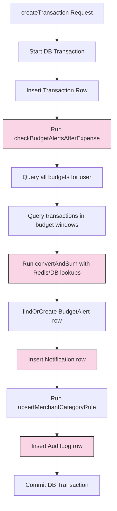
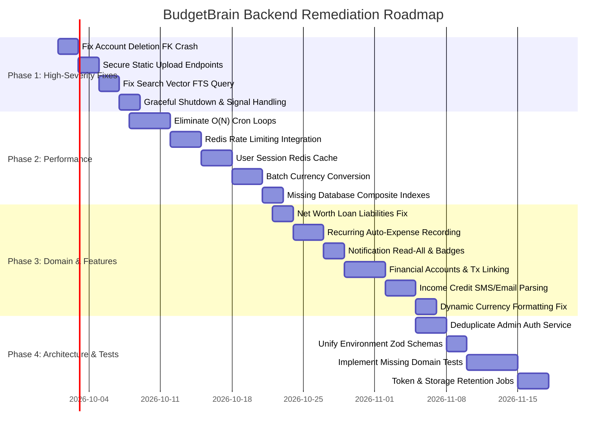

# BudgetBrain Backend — Comprehensive Gap Analysis & Optimization Plan

> **Scope**: `backend/` (Shared Modules, Database, Core Infrastructure, Queue Workers, Mobile, Web, and Admin APIs)  
> **Status**: Completed Assessment & Architecture Roadmap  
> **Date**: September 2026

---

## Executive Summary

BudgetBrain's backend is architected as **three independent Express applications** (`mobile` on port 3001, `web` on port 3002, `admin` on port 3003) backed by a shared domain layer (`src/shared/modules/`), shared infrastructure core (`src/core/`), BullMQ background workers (`src/queue/`), and a PostgreSQL database managed via Sequelize (`database/`).

While the structural migration unified many patterns, deep analysis reveals **critical performance bottlenecks**, **code architectural violations**, **ACID & security risks**, and **functional disconnects** between business domains (such as loans/accounts not reflecting in transactions, unindexed search paths, and missing API capabilities).

This plan provides a categorized, prioritized, and file-referenced analysis of all identified gaps, paired with a phased implementation roadmap.

---

## 1. Performance Gaps

### 1.1 Inefficient Queries & N+1 / Sequential Execution Loops

| Location | Issue | Impact | Recommended Fix |
| :--- | :--- | :--- | :--- |
| [`src/jobs/scheduledNotifications.ts`](file:///Users/navneet/Projects/Mobile-apps/BudgetBrain/backend/src/jobs/scheduledNotifications.ts#L10-L42) (`runDailyReminder`) | Iterates sequentially over `User.findAll({ attributes: ['id'] })`. For every single user in the database, executes `Transaction.count` and `Notification.findOne`. | For 10,000 users, issues **20,001 sequential SQL queries**. Blocks cron execution for minutes to hours, causes database connection pool saturation. | Replace with a single SQL query: `SELECT u.id FROM users u LEFT JOIN transactions t ON t.user_id = u.id AND t.created_at >= :today LEFT JOIN notifications n ON n.user_id = u.id AND n.type = 'daily_reminder' AND n.sent_at >= :today WHERE t.id IS NULL AND n.id IS NULL`. Enqueue notification jobs in bulk. |
| [`src/jobs/scheduledNotifications.ts`](file:///Users/navneet/Projects/Mobile-apps/BudgetBrain/backend/src/jobs/scheduledNotifications.ts#L92-L136) (`runRecurringExpenseCheck`) | Uses `limit: 500, offset` pagination on transactions, and executes an individual `Notification.findOne` inside the loop for each row. | Offset pagination degrades quadratically ($O(N^2)$ page-scan cost). Sequential notification checks generate hundreds of round trips. | Use keyset cursor pagination (`WHERE id > :lastId ORDER BY id ASC LIMIT 500`) and batch-check existing notifications via `WHERE (user_id, sent_at) IN (...)` or temporary join. |
| [`src/shared/modules/expenses/service/expenses.service.ts`](file:///Users/navneet/Projects/Mobile-apps/BudgetBrain/backend/src/shared/modules/expenses/service/expenses.service.ts#L563-L671) (`getSpendingTrends`) | Iterates over up to 180 daily buckets in `rowsByDate` and calls `await convertAndSum(dayRows, currency)` **sequentially in a loop**. | Up to 180 async calls per dashboard request. When multiple currencies exist, causes heavy Redis/DB load and slows dashboard response by 300–800ms. | Group conversions by source currency upfront across the entire 6-month set, resolve exchange rates in a single batch, and convert synchronously in memory. |
| [`src/shared/currency/currency.engine.ts`](file:///Users/navneet/Projects/Mobile-apps/BudgetBrain/backend/src/shared/currency/currency.engine.ts#L79-L89) (`convertAndSum`) | Awaits `convertAmount` for every row in a `for...of` loop: `total += await convertAmount(...)`. | If passed 200 rows, runs 200 sequential async calls, each querying cache/DB for exchange rates. | Aggregate amounts by source currency first (`Map<currency, sum>`), fetch rates for distinct currencies in parallel via `Promise.all` or a single Redis multi-get, then compute the total synchronously. |
| [`src/shared/modules/budgets/service/budget.service.ts`](file:///Users/navneet/Projects/Mobile-apps/BudgetBrain/backend/src/shared/modules/budgets/service/budget.service.ts#L127-L144) (`enrichBudgetsWithSpent`) | Calls `computeBudgetSpent` and `computeRolloverAmount` independently per budget. `computeCompoundingRollover` walks up to 24 periods per budget. | For 10 budgets, executes 10 to 30 separate `Transaction.findAll` queries with date bounds. | Fetch all user transactions within the envelope of minimum start date and maximum end date in **one single query**, then bucket rows by `categoryId` and period in memory. |
| [`src/shared/modules/recurring/service/recurringSeries.service.ts`](file:///Users/navneet/Projects/Mobile-apps/BudgetBrain/backend/src/shared/modules/recurring/service/recurringSeries.service.ts#L96-L107) (`listRecurringSeries`) | Invocates `await detectRecurringSeries(userId)` on **every call to list recurring series**, including dashboard widgets (`listUpcomingForDashboard`). | Reads 180 days of user transactions every time the user visits the recurring tab or dashboard. | Decouple recurring detection from the read path. Run detection asynchronously (in cron `runRecurringDetection` or debounced queue job upon creating an expense flagged `isRecurring`). |
| [`src/shared/currency/currency.engine.ts`](file:///Users/navneet/Projects/Mobile-apps/BudgetBrain/backend/src/shared/currency/currency.engine.ts#L91-L116) (`upsertRatesToInrTable`) | Nested loops for all supported currency pairs executing `ExchangeRate.findOne` followed by individual `create` or `update`. | 30 individual queries sequentially executed. | Use `ExchangeRate.bulkCreate(records, { updateOnDuplicate: ['rate', 'updatedAt'] })` in a single SQL operation. |

---

### 1.2 Database Indexing & Search Engine Gaps

| Table / Feature | Current State | Bottleneck | Remediation |
| :--- | :--- | :--- | :--- |
| `transactions` (Search Filter) | [`expenses.service.ts:137`](file:///Users/navneet/Projects/Mobile-apps/BudgetBrain/backend/src/shared/modules/expenses/service/expenses.service.ts#L137): `where.searchVector = { [Op.iLike]: `%${filters.search}%` }` | Migration `20250106000000-add-full-text-search-tsvectors.js` created an indexed `fts` GIN column, but `expenses.service.ts` queries an unindexed text column `search_vector` with leading wildcard `%...%`, forcing a **sequential table scan** on every search! | Use PostgreSQL full-text search: `where.fts = { [Op.match]: fn('plainto_tsquery', 'english', filters.search) }` utilizing `transactions_fts_idx`. Keep `search_vector` only if trigram fallback is explicitly requested. |
| `transactions` (List & Sort) | Indexes: `(user_id, date)`, `(user_id, type)`, `(category_id)`. | Queries sort by `[['date', 'DESC'], ['createdAt', 'DESC']]`. Filtering by `(user_id, date)` cannot satisfy the sort order without an in-memory sort buffer (`filesort`). | Add composite index `CREATE INDEX idx_transactions_user_date_created ON transactions (user_id, date DESC, created_at DESC)`. |
| `transactions` (Type + Date Filter) | Filtering by `(user_id, type, date)` (used by `getTransactionsSummary`, `income.service`, `expenses.service`) | Optimizer must intersect single-column indexes or scan large partitions. | Add composite index `CREATE INDEX idx_transactions_user_type_date ON transactions (user_id, type, date DESC)`. |
| `notifications` (Unread & Listing) | Index: only primary key and FK `user_id`. | Listing sorts by `sentAt DESC`. Filtering by `read = false` scans all notifications for the user. | Add composite index `CREATE INDEX idx_notifications_user_sent_read ON notifications (user_id, sent_at DESC, read)`. |
| `financial_accounts` | Index: `user_id`. | Listing filters by `where: { userId, isActive: true }`. | Add composite index `CREATE INDEX idx_financial_accounts_user_active ON financial_accounts (user_id, is_active)`. |
| `budget_alerts` | Unique index exists on `(budget_id, user_id, threshold, period_start)`. | Queries looking up alerts by `(user_id, triggered_at)` perform sequential index scans. | Add index `CREATE INDEX idx_budget_alerts_user_triggered ON budget_alerts (user_id, triggered_at DESC)`. |

---

### 1.3 Caching, Session Management & Middleware Performance

| Component | Current State | Issue | Solution |
| :--- | :--- | :--- | :--- |
| **Authentication Middleware** | [`core/auth/authenticate.ts:23`](file:///Users/navneet/Projects/Mobile-apps/BudgetBrain/backend/src/core/auth/authenticate.ts#L23): `User.findByPk(payload.userId)` on **every single authenticated request**. | 5 concurrent API calls from a screen (dashboard, budgets, categories, notifications, profile) trigger **5 identical database queries** for the user row. | Cache active user session in Redis with 5-minute TTL (`user:session:<id>`), invalidated on profile update or password/role change. Fall back to DB on miss. |
| **Rate Limiter Storage** | [`core/middleware/rateLimit.ts`](file:///Users/navneet/Projects/Mobile-apps/BudgetBrain/backend/src/core/middleware/rateLimit.ts#L3-L55): Uses default `MemoryStore`. | Counters are kept in each process's memory. With 3 separate apps (`mobile`, `web`, `admin`) plus PM2/container scaling, rate limits are neither synchronized nor enforceable across instances. Process restarts wipe counters. | Integrate `rate-limit-redis` with the existing `ioredis` client connection. |
| **CPU-Bound Password Hashing** | [`core/auth/jwt.ts:27-33`](file:///Users/navneet/Projects/Mobile-apps/BudgetBrain/backend/src/core/auth/jwt.ts#L27-L33): Uses pure JavaScript `bcryptjs.hash(..., 12)`. | Pure JS bcrypt blocks the single-threaded Node.js event loop for 250–400ms per registration/login request, starving all other I/O during concurrent auth attempts. | Switch to native `bcrypt` (C++ addon) or `argon2`, which execute asynchronously on the libuv worker threadpool without blocking the main event loop. |
| **Synchronous Disk I/O** | [`core/storage/s3.service.ts:82, 120`](file:///Users/navneet/Projects/Mobile-apps/BudgetBrain/backend/src/core/storage/s3.service.ts#L82): `fs.writeFileSync(localPath, buffer)` | Blocks the event loop while writing multi-megabyte image/report files to disk when local storage is active. | Use asynchronous `fs.promises.writeFile(localPath, buffer)`. |
| **Unbounded Report Memory Buffering** | [`modules/reports/service/report.service.ts:85`](file:///Users/navneet/Projects/Mobile-apps/BudgetBrain/backend/src/shared/modules/reports/service/report.service.ts#L85): `Transaction.findAll` loads all matched rows into Node.js heap at once. | Users with 50,000+ transactions will trigger Node.js Out-Of-Memory (OOM) heap crashes during CSV/Excel/PDF generation. | Stream query results using `sequelize.query` with cursors or batch chunking into ExcelJS/CSV streams directly. |

---

## 2. Code Gaps & Technical Debt

### 2.1 Architectural Violations & Duplication

#### A. Massive Auth Code Duplication in Admin
- **File**: [`src/admin/features/auth/service/auth.service.ts`](file:///Users/navneet/Projects/Mobile-apps/BudgetBrain/backend/src/admin/features/auth/service/auth.service.ts) (478 lines)
- **Violation**: AGENTS.md explicitly states: *"A new domain gets one entry in `src/shared/modules/<domain>/`... Controllers call the shared module's service — never query models directly."*
- **Detail**: Admin re-implements `register`, `login`, `refreshToken`, `logout`, `verifyEmail`, `requestPasswordReset`, `resetPassword`, and `changePassword`, duplicating queries to `User`, `RefreshToken`, and `VerificationToken`.
- **Fix**: Remove `admin/features/auth/service/auth.service.ts`. Have `admin/features/auth/auth.controller.ts` call `@shared/modules/auth/service/auth.service.ts` directly, utilizing `@core/permissions` to enforce admin role requirements.

#### B. Quadruplicated Environment Config
- **Files**:
  - [`src/config/env.ts`](file:///Users/navneet/Projects/Mobile-apps/BudgetBrain/backend/src/config/env.ts)
  - [`src/mobile/shared/config/env.ts`](file:///Users/navneet/Projects/Mobile-apps/BudgetBrain/backend/src/mobile/shared/config/env.ts)
  - [`src/web/shared/config/env.ts`](file:///Users/navneet/Projects/Mobile-apps/BudgetBrain/backend/src/web/shared/config/env.ts)
  - [`src/admin/shared/config/env.ts`](file:///Users/navneet/Projects/Mobile-apps/BudgetBrain/backend/src/admin/shared/config/env.ts)
- **Issue**: Identical 50-line Zod schema copied 4 times across the codebase. Schema changes must be manually synced across all 4 files. Port defaults conflict (`PORT=3000` vs `PORT_MOBILE=3001`).
- **Fix**: Define the base environment schema once in `src/config/env.ts`. Per-app configs should import the base schema and extend only app-specific keys (like port and prefix).

---

### 2.2 Transaction Management & ACID Inconsistencies

1. **Prolonged Lock Contention in `createTransaction`**:
   - `createTransaction` holds an open PostgreSQL row/table lock while performing:
     1. Multi-currency calculations (`convertAndSum`)
     2. Budget alert threshold evaluations
     3. Synchronous notification insertions
     4. Merchant categorization rule updates
     5. Synchronous audit log database insertions
   - **Remediation**: Commit the core transaction immediately after creating the `Transaction` record. Move budget alert evaluation and merchant rule learning to a post-commit asynchronous event or BullMQ queue job.

2. **Missing Budget Alert Checks on Updates**:
   - [`expenses.service.ts:290-368`](file:///Users/navneet/Projects/Mobile-apps/BudgetBrain/backend/src/shared/modules/expenses/service/expenses.service.ts#L290-L368): If a user updates an expense amount from ₹100 to ₹100,000, `checkBudgetAlertsAfterExpense` is **never invoked**. A user can blow past their budget without receiving any alert.
   - **Remediation**: Trigger budget alert evaluations in `updateTransaction` whenever `amount`, `date`, or `categoryId` changes.

3. **Untransactional `duplicateTransaction`**:
   - [`expenses.service.ts:402-412`](file:///Users/navneet/Projects/Mobile-apps/BudgetBrain/backend/src/shared/modules/expenses/service/expenses.service.ts#L402-L412): Uses unsafe `any` casts, does not open a database transaction, does not write an audit log, does not check budget alerts, and does not duplicate attachments or splits.

4. **Foreign Key Constraint Crash on User Account Deletion (`deleteUserAccount`)**:
   - [`users.service.ts:78-152`](file:///Users/navneet/Projects/Mobile-apps/BudgetBrain/backend/src/shared/modules/users/users.service.ts#L78-L152): Explicitly deletes records from 18 tables, but **omits 6 FK-dependent tables**:
     - `subscriptions` (`userId`)
     - `ai_usage_quotas` (`userId`)
     - `webauthn_credentials` (`userId`)
     - `family_invites` (`invitedBy`)
     - `income_allocations` (`financialAccountId` & `incomeTransactionId`)
     - `sso_handoff_tokens` (`userId`)
   - **Critical Failure**: When a user who has ever initiated an SSO handoff, created a passkey, or subscribed attempts to delete their account, PostgreSQL throws `23503: foreign_key_violation`, resulting in a 500 error and failing GDPR compliance.
   - **Remediation**: Add all missing models to `deleteUserAccount` within the transaction, or configure `ON DELETE CASCADE` at the PostgreSQL schema level for user-owned records.

5. **Storage Orphan Leaks on File Deletion**:
   - [`attachments.service.ts:93-101`](file:///Users/navneet/Projects/Mobile-apps/BudgetBrain/backend/src/shared/modules/expenses/service/attachments.service.ts#L93-L101) (`deleteTransactionAttachment`): Calls `attachment.destroy()` on the DB row, but **never deletes the file from S3 or local disk**. Orphaned images and receipts accumulate indefinitely in storage.
   - **Remediation**: Call `s3Client.send(new DeleteObjectCommand({ Bucket, Key }))` or `fs.promises.unlink()` upon deleting the attachment record.

---

### 2.3 Security & Production Readiness Gaps

| Issue | Severity | Location | Description & Fix |
| :--- | :--- | :--- | :--- |
| **Unauthenticated Static File Access** | **High** | [`mobile/app.ts:30-31`](file:///Users/navneet/Projects/Mobile-apps/BudgetBrain/backend/src/mobile/app.ts#L30), [`web/app.ts:40-41`](file:///Users/navneet/Projects/Mobile-apps/BudgetBrain/backend/src/web/app.ts#L40) | `/uploads` and `/{app}/uploads` are mounted via `express.static()` without any authentication middleware. Anyone can download private bank receipts, invoices, and export PDFs by URL enumeration. **Fix:** Restrict static upload directories; serve uploads strictly via presigned S3 URLs or an authenticated streaming route `GET /api/v1/attachments/:id/download`. |
| **SSL Validation Disabled** | **Medium** | [`database/config/database.ts:37`](file:///Users/navneet/Projects/Mobile-apps/BudgetBrain/backend/database/config/database.ts#L37) | Remote database connection sets `ssl.rejectUnauthorized: false`. Disables SSL certificate verification, making database connections vulnerable to Man-In-The-Middle (MITM) attacks. **Fix:** Provide the cloud provider's CA root certificate (e.g. AWS RDS bundle) and enforce `rejectUnauthorized: true`. |
| **Hardcoded WebAuthn Origin** | **Medium** | [`webauthn.service.ts:22-26`](file:///Users/navneet/Projects/Mobile-apps/BudgetBrain/backend/src/shared/modules/auth/service/webauthn.service.ts#L22-L26) | `expectedOrigin` returns `env.APP_URL` directly. When mobile apps or web frontends run on differing domains (e.g., `https://app.budgetbrain.com` vs backend `https://api.budgetbrain.com`), passkey authentication fails signature verification. **Fix:** Support an array of configured valid origins or dynamic matching against allowed client origins. |
| **Missing Graceful Shutdown Lifecycle** | **Medium** | [`src/shared/startup.ts:23-41`](file:///Users/navneet/Projects/Mobile-apps/BudgetBrain/backend/src/shared/startup.ts#L23-L41) | Server starts via `app.listen()` without capturing the `Server` instance. No signal listeners for `SIGTERM` or `SIGINT`. On PM2 reload or container termination, active requests are terminated abruptly and BullMQ jobs are halted mid-task. **Fix:** Implement graceful shutdown: stop accepting new requests, drain keep-alive sockets, wait for active transactions, call `stopWorkers()`, `stopJobs()`, and disconnect Sequelize/Redis. |
| **Worker Execution Unconfigured in PM2** | **Medium** | [`ecosystem.config.cjs`](file:///Users/navneet/Projects/Mobile-apps/BudgetBrain/backend/ecosystem.config.cjs) | BullMQ workers only start if `ENABLE_QUEUE_WORKERS === 'true'`, but this flag is not set in `ecosystem.config.cjs` for `budgetbrain-web`. In PM2 production deployments, background workers (email, receipts, reports, push) do not start unless manually configured. |

---

## 3. Missing Functionality Gaps

### 3.1 Core Accounting & Domain Integration Gaps

#### A. Automated Recurring Bill / Subscription Expense Generation
- **Current State**: When a recurring series reaches `nextDueDate`, [`scheduledNotifications.ts`](file:///Users/navneet/Projects/Mobile-apps/BudgetBrain/backend/src/jobs/scheduledNotifications.ts) sends a reminder notification, and [`recurringSeries.service.ts:218`](file:///Users/navneet/Projects/Mobile-apps/BudgetBrain/backend/src/shared/modules/recurring/service/recurringSeries.service.ts#L218) rolls `nextDueDate` forward.
- **Missing**: **No expense transaction is ever created!** The user's recurring expenses (Netflix, rent, utility bills) are never logged to `transactions`, distorting monthly spending, category totals, and budget tracking.
- **Requirement**:
  1. Add an `autoRecord: boolean` flag to `RecurringSeries`.
  2. In the daily cron job, if `autoRecord === true`, automatically create a `Transaction` row linked to `recurringSeriesId`.
  3. If `autoRecord === false`, provide an API endpoint `POST /recurring-series/:id/record` to allow 1-click expense logging from the reminder notification.

#### B. Disconnect Between `FinancialAccount` and `Transaction`
- **Current State**: `FinancialAccount` tracks bank/card/wallet balances. However, `Transaction` has **no foreign key** to `financial_accounts` (`accountId` is absent from `transaction.model.ts`).
- **Missing**:
  1. Logging an expense or income does not adjust account balances (only `allocateIncomeToAccounts` exists as a detached post-hoc action).
  2. No Account-to-Account Transfer functionality (`transferBetweenAccounts` with source and destination accounts).
  3. Credit card accounts do not track billing cycles or due dates.
- **Requirement**: Add optional `financialAccountId` to `Transaction`. When provided, automatically update the account balance inside the creation transaction. Implement a dedicated Transfer endpoint.

#### C. Loans Omitted from Expense History & Net Worth
- **Current State**:
  - `payLoan` records a `LoanPayment` and reduces `loan.remainingBalance`.
  - **Missing in Expenses**: It does **not** create an expense transaction. Paying a ₹30,000 EMI is completely invisible in spending trends, category breakdowns, and monthly reports.
  - **Missing in Net Worth**: In [`net-worth.service.ts:35-53`](file:///Users/navneet/Projects/Mobile-apps/BudgetBrain/backend/src/shared/modules/net-worth/net-worth.service.ts#L35-L53), `totalLiabilities` **only includes credit card balances**! Loans are completely ignored! A user with a ₹50,00,000 home loan shows ₹0 in loan liabilities.
- **Requirement**:
  1. In `payLoan`, automatically generate an `expense` transaction categorized under "Loan / EMI" (or allow linking).
  2. In `getNetWorthDashboard`, query all open loans (`Loan.findAll({ where: { userId, closed: false } })`), convert `remainingBalance` to target currency, and include it in `totalLiabilities`.

#### D. Income SMS / Email Parser Deficiency
- **Current State**: [`parse.service.ts`](file:///Users/navneet/Projects/Mobile-apps/BudgetBrain/backend/src/shared/modules/integrations/service/parse.service.ts) only regex-matches `debited` and `spent`. In [`integrations.service.ts:80`](file:///Users/navneet/Projects/Mobile-apps/BudgetBrain/backend/src/shared/modules/integrations/service/integrations.service.ts#L80), `confirmParsed` hardcodes `type: 'expense'`.
- **Missing**: Salary credits, bank refunds, UPI receipts, and dividend deposits cannot be parsed or categorized as income.
- **Requirement**: Expand regex patterns to detect credit keywords (`credited`, `received`, `deposited`). Store parsed `type` ('income' vs 'expense') on `ParsedTransaction` and support confirming both types in `confirmParsed`.

#### E. Missing CRUD Operations in Secondary Domains
- **Accounts**: [`accounts.service.ts`](file:///Users/navneet/Projects/Mobile-apps/BudgetBrain/backend/src/shared/modules/accounts/accounts.service.ts) is missing `deleteAccount` / `archiveAccount` and `getAccountById`.
- **Investments**: [`investments.service.ts`](file:///Users/navneet/Projects/Mobile-apps/BudgetBrain/backend/src/shared/modules/investments/investments.service.ts) is missing `deleteInvestment`, `getInvestmentById`, and has no live market price sync integration.

---

### 3.2 Notification & Support Ticket Gaps

1. **Missing Bulk Notification Actions**:
   - `notification.service.ts` only provides `markAsRead(userId, id)`.
   - **Missing**:
     - `PATCH /notifications/read-all` (`markAllAsRead`)
     - `GET /notifications/unread-count` (Badge counter endpoint)
     - `DELETE /notifications/:id` & `DELETE /notifications/all` (Clearing notification history)
   - Mobile and Web apps currently must fetch all notifications and count unread items client-side.

2. **Incomplete Support Ticket Lifecycle**:
   - `support.service.ts` allows creating and viewing tickets.
   - When an admin resolves a ticket or adds `adminNotes` via `admin.service.ts`, **no email or in-app notification is sent to the user**.
   - Users cannot reply to tickets or attach screenshots/receipts to tickets.

3. **Currency Hardcoding**:
   - Notifications and AI insights hardcode the Indian Rupee symbol `₹`:
     - [`scheduledNotifications.ts:123`](file:///Users/navneet/Projects/Mobile-apps/BudgetBrain/backend/src/jobs/scheduledNotifications.ts#L123): `₹${tx.amount}`
     - [`scheduledNotifications.ts:154`](file:///Users/navneet/Projects/Mobile-apps/BudgetBrain/backend/src/jobs/scheduledNotifications.ts#L154): `₹${thisWeek.toFixed(2)}`
     - [`ai.service.ts:53, 64`](file:///Users/navneet/Projects/Mobile-apps/BudgetBrain/backend/src/shared/modules/ai/service/ai.service.ts#L53): `₹${suggested.toFixed(0)}`
     - [`recurringSeries.service.ts:205`](file:///Users/navneet/Projects/Mobile-apps/BudgetBrain/backend/src/shared/modules/recurring/service/recurringSeries.service.ts#L205): `₹${Number(s.amount).toFixed(2)}`
   - Users with USD, EUR, GBP, AED, or SGD settings receive notifications with misleading currency symbols.

---

### 3.3 Data Retention & Lifecycle Maintenance

- **Orphaned Token Accumulation**: Tables `verification_tokens`, `sso_handoff_tokens`, and `refresh_tokens` accumulate expired rows indefinitely. There is no scheduled vacuum or purge task.
- **Report S3 Bucket Bloat**: Server-generated PDF/Excel/CSV reports stored in `budgetbrain/reports/` have no expiration or cleanup lifecycle.
- **Audit Log Growth**: `audit_logs` table has no partitioning or archiving strategy for older records.

---

## 4. Test Coverage Gaps

The following modules in `src/shared/modules/` currently have **zero unit/integration test coverage**:

| Domain | Files Missing Tests | Critical Untested Paths |
| :--- | :--- | :--- |
| **`accounts`** | `accounts.service.ts` | Account creation, balance updates, currency assignment. |
| **`investments`** | `investments.service.ts` | Current value calculation, gain/loss computation. |
| **`support`** | `support.service.ts` | Ticket creation, priority default assignment, retrieval. |
| **`notifications`** | `notification.service.ts`, `push.service.ts` | Device token registration, duplicate token handling, dead token pruning. |
| **`integrations`** | `integrations.service.ts`, `parse.service.ts` | Regex parsing of SMS/email, transaction confirmation. |
| **`users`** | `users.service.ts` | Profile updates, onboarding completion, account deletion cascade. |
| **`mobile/features`** | All controllers & route bindings | Route permissions, parameter validation, rate limiter application. |
| **`web/features`** | All controllers & route bindings | Route permissions, parameter validation, rate limiter application. |

---

## 5. Phased Implementation Roadmap

### Phase 1: High-Severity Bug & Security Remediation (Immediate)
1. **Fix `deleteUserAccount` FK Deletion Crash**: Include `Subscription`, `AiUsageQuota`, `WebauthnCredential`, `FamilyInvite`, `IncomeAllocation`, and `SsoHandoffToken` inside the deletion transaction.
2. **Secure `/uploads` Directory**: Remove unauthenticated `express.static()` mount. Protect access via presigned URLs or authenticated streaming.
3. **Fix Full-Text Search**: Update `expenses.service.ts` to utilize PostgreSQL `fts` and the existing GIN index instead of unindexed `ILIKE %...%`.
4. **Implement Graceful Shutdown**: Capture HTTP server instances and attach `SIGTERM`/`SIGINT` handlers to gracefully drain connections, workers, and database pools.

### Phase 2: Performance Optimization & Caching (Near-Term)
1. **Refactor O(N) Cron Jobs**: Rewrite `runDailyReminder`, `runRecurringExpenseCheck`, and `sendBillDueReminders` into batched set-based SQL queries.
2. **Distributed Redis Rate Limiting**: Replace `MemoryStore` in `rateLimit.ts` with `rate-limit-redis`.
3. **User Authentication Session Caching**: Cache authenticated user profiles in Redis to eliminate redundant `User.findByPk` queries on every request.
4. **Batch Currency Conversions**: Optimize `convertAndSum` and `getSpendingTrends` to aggregate by distinct currency before executing conversions.
5. **Add Missing Composite Indexes**: Apply migrations for `(user_id, date, created_at)`, `(user_id, type, date)`, and `(user_id, sent_at, read)`.

### Phase 3: Core Domain & Feature Completions (Mid-Term)
1. **Fix Net Worth Liabilities**: Incorporate open loan balances (`Loan.remainingBalance`) into `getNetWorthDashboard`.
2. **Recurring Series Auto-Logging**: Add `autoRecord` option to `RecurringSeries` and generate expense records when bills are due.
3. **Notification Management APIs**: Implement `PATCH /notifications/read-all`, `GET /notifications/unread-count`, and bulk deletion.
4. **Link Financial Accounts to Expenses**: Add optional `financialAccountId` to `Transaction` and automate account balance deductions.
5. **Income Support in Parser**: Add credit patterns to `parseSmsContent` and support confirming income transactions in `confirmParsed`.
6. **Dynamic Currency Formatting**: Replace hardcoded `₹` with user-configured currency symbols in notifications and AI summaries.

### Phase 4: Architecture Cleanup, Retention & Quality (Hardening)
1. **Deduplicate Admin Auth**: Delete `admin/features/auth/service/auth.service.ts` and delegate to `@shared/modules/auth`.
2. **Unify Environment Schemas**: Consolidate `env.ts` across `mobile`, `web`, and `admin` to a single source of truth.
3. **Data Retention Jobs**: Implement cron cleanup for expired tokens (`verification_tokens`, `sso_handoff_tokens`, `refresh_tokens`) and report storage lifecycles.
4. **Fill Test Coverage Gaps**: Write test suites for `accounts`, `investments`, `support`, `notifications`, `integrations`, and `users`.
